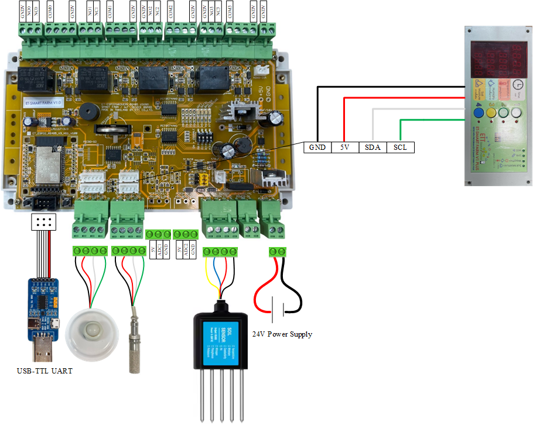

<!DOCTYPE html>
<html lang="en">
<head>
  <meta charset="UTF-8">
</head>
<body>

<h1>🌾 ETT Smart Farm V1 Plus – Main Controller for Smart Agriculture Projects</h1>

ETT Smart Farm V1 Plus is a microcontroller board tailored for Smart Agriculture. It integrates RS485, I²C, RTC, and relay control to support soil sensors (pH, NPK, moisture, temperature, humidity) and is ideal for real-time monitoring and automation in smart farming systems.

## 📘 คู่มือการใช้งาน (Manual & Documentation)

- [🔗 คู่มือจากเว็บไซต์ ETT Smart Farm V1 Plus](https://www.etteam.com/productI2C_RS485/ET-SMART-FARM-V1P/index.html)

  <h1>Installing MicroPython on ESP32 using Thonny</h1>
  
This guide will help you install MicroPython firmware on an ESP32 (e.g., ESP32 WROVER) using the Thonny IDE.

  

  <h2>🧩 Step 1: Install Thonny</h2>
  
Download and install the Thonny IDE from: <a href="https://thonny.org">https://thonny.org</a>

  

  <h2>🔌 Step 2: Connect Your ESP32</h2>
  <ul>
    <li>Use a USB or USB-to-TTL cable to connect your ESP32 to your computer.</li>
    <li>Ensure the correct port (e.g., COM3, /dev/ttyUSB0) is visible.</li>
  </ul>

  

  <h2>⚙️ Step 3: Select MicroPython Interpreter</h2>
     1. Open Thonny. 
     2. Go to Tools &gt; Options. 
     3. Navigate to the Interpreter tab. 
     4. Select: MicroPython (ESP32). 
     5. Select the correct port connected to your ESP32. 
  

  

  <h2>📥 Step 4: Download MicroPython Firmware</h2>
  <ul>
    <li>Go to: <a href="https://micropython.org/download/ESP32_GENERIC">https://micropython.org/download/ESP32_GENERIC</a></li>
    <li>Download the firmware that supports your board. Example: <code>ESP32_GENERIC-SPIRAM-20250415-v1.25.0.bin</code></li>
  </ul>

  

  <h2>🚀 Step 5: Flash MicroPython Firmware</h2>
  <ol>
    <li>In Thonny, go to Tools &gt; Install or update MicroPython.</li>
    <li>Select the downloaded firmware file.</li>
    <li>Click Install.</li>
  </ol>
  <ul>
    <li>Thonny will erase the flash memory.</li>
    <li>Thonny will install the firmware automatically.</li>
  </ul>

  

  <h2>✅ Step 6: Verify Installation</h2>
  
You should see this message:

  <pre>
MicroPython v1.x.x on 202x-xx-xx; ESP32 module with ESP32
Type "help()" for more information.
>>>
  </pre>

  

  <h2>💡 Troubleshooting</h2>
  
If installation fails, press and hold the <strong>BOOT</strong> button while connecting the board to enter flashing mode.

  

  <h1>ETT-Smart Farm Wiring Diagram</h1>
  
This wiring diagram shows how to connect all the components.

  

  ### 🧷 Color Code for Wiring

  - 🔴 **Red**: Power (VCC, 3.3V/5V/24V)
  - ⚫ **Black**: Ground (GND)
  - 🟡 **Yellow**: RS485 A+
  - 🔵 **Blue**: RS485 B−
  - 🟢 **Green**: SCL
  - ⚪ **White**: SDA

</body>
</html>
