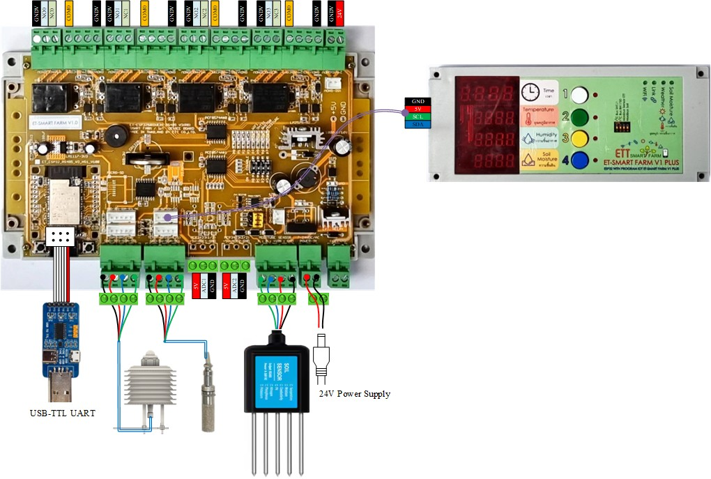

<!DOCTYPE html>
<html lang="en">
<head>
  <meta charset="UTF-8">
</head>
<body>

<h1>🌾 ETT Smart Farm V1 Plus – Main Controller for Smart Agriculture Projects</h1>

ETT Smart Farm V1 Plus is a microcontroller board tailored for Smart Agriculture. It integrates RS485, I²C, RTC, and relay control to support soil sensors (pH, NPK, moisture, temperature, humidity) and is ideal for real-time monitoring and automation in smart farming systems.

## 📘 Manual & Documentation

- [🔗 Documentation From ETT Smart Farm V1 Plus](https://www.etteam.com/productI2C_RS485/ET-SMART-FARM-V1P/index.html)

<h1>Installing MicroPython on ESP32 using Thonny</h1>

This guide will help you install MicroPython firmware on an ESP32 (e.g., ESP32 WROVER) using the Thonny IDE.

<h2>🧩 Step 1: Install Thonny</h2>

Download and install the Thonny IDE from: <a href="https://thonny.org">https://thonny.org</a>

<h2>🔌 Step 2: Connect Your ESP32</h2>
<ul>

Plug your ESP32 board into your computer via USB. If it's not recognized, install the appropriate USB driver (e.g., CH340 or CP210x).

</ul>

<h2>📥 Step 3: Download MicroPython Firmware</h2>
<ul>
      <li>Get the latest ESP32 firmware from the official site:</li>
      <li>👉<a href="https://micropython.org/download/esp32">https://micropython.org/download/esp32</a></li>
</ul>

<h2>⚙️Step 4: Flash the Firmware Using Thonny</h2>
<ol>
      <li>Open Thonny.</li>
      <li>Navigate to Tools > Install or update MicroPython firmware</li>
      <li>Select the correct serial port and the .bin firmware file</li>
      <li>Click Install</li>
      <li>Set Up the Interpreter</li>
      <li>Go to Tools > Options > Interpreter</li>

You're Ready! Once installed, the MicroPython REPL will appear in Thonny’s shell. You can now begin writing and uploading code to your ESP32.

</ol>

<h2>📥 Step 5: Set Interpreter to MicroPython (ESP32)</h2>
      <li>Select the correct Port (e.g., COM3 or /dev/ttyUSB0)</li>
      <li>Click OK</li>

You're Ready! Once installed, the MicroPython REPL will appear in Thonny’s shell. You can now begin writing and uploading code to your ESP32.

  

  <h1>ETT-Smart Farm Wiring Diagram</h1>
  
This wiring diagram shows how to connect all the components.

  

  ### 🖌 Color Code for Wiring

  - 🔴 **Red**: Power (VCC, 3.3V/5V/24V)
  - ⚫ **Black**: Ground (GND)
  - 🔵 **Blue**: SDA
  - 🟢 **Green**: SCL

</body>
</html>
